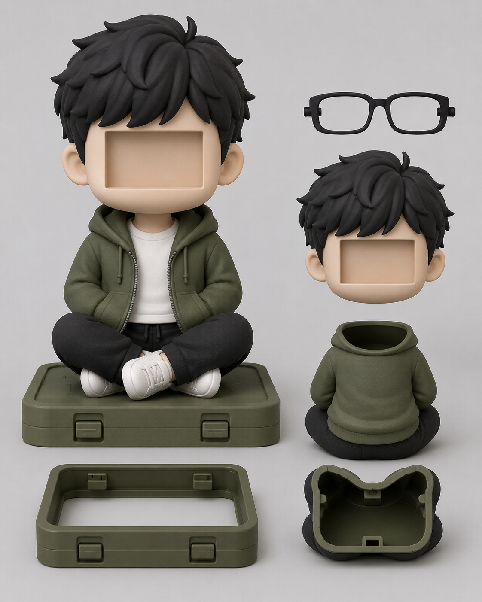

<p align="center">
  
  

</p>

<h1 align="center">WITH-U 🤖🧸</h1>

<p align="center">
  <em>我把另一个自己写进了代码里，装进玩偶，让它替我去陪她。</em>
</p>

<p align="center">
  <a href="https://github.com/huayu0824/WITH-U/blob/main/LICENSE"></a>
  <a href="#"></a>
  <a href="#"></a>
  <a href="#"></a>
  <a href="#"></a>
</p>

---

**WITH-U** 是一个实体 AI 语音交互玩偶项目。基于 ESP32-S3 构建硬件本体，端到端跑通语音识别→大模型推理→超拟声合成，装进 3D 打印外壳里，让ta变成一个可以抱在怀里说话的存在。

## ✨ 功能一览

| 功能 | 说明 |
|------|------|
| 🎤 **语音对话** | 按住说话，松开自动回复。端到端延迟约 2~4 秒 |
| 🗣️ **超拟声 TTS** | CosyVoice 复刻声音，不是机器人腔 |
| 🖥️ **OLED 显示** | 实时反馈对话状态：听、想、说 |
| 🔄 **OTA 升级** | 远程推送固件，不用拆外壳 |
| 📊 **Web 管理面板** | 日志监控、手动推送语录、系统控制 |
| 💾 **对话记录** | 每条对话自动存到 TF 卡 |
| 🐚 **3D 打印外壳** | 自锁按钮、USB-C 充电、完整外观设计 |

## 📐 架构

```
┌─────────────────────────┐         ┌──────────────────────────────┐
│    ESP32-S3 硬件本体      │         │        FastAPI 后端            │
│                          │         │                              │
│  ┌───────────────────┐   │ HTTP/WS │  ┌────────────────────┐     │
│  │ INMP441 麦克风     │──┼─────────┼──┤ ASR 语音识别       │     │
│  │ MAX98357 扬声器    │──┼─────────┼──┤ → DeepSeek LLM     │     │
│  │ 0.96" OLED        │   │         │  │ → CosyVoice TTS   │     │
│  │ SHT3X 温湿度      │   │         │  └────────────────────┘     │
│  │ TF 卡存储          │   │         │                              │
│  └───────────────────┘   │         │  阿里云 · DeepSeek · DashScope│
│  ┌───────────────────┐   │         └──────────────────────────────┘
│  │ WiFi + OTA 升级    │   │
│  │ Web 管理面板(HTML) │   │
│  └───────────────────┘   │
└─────────────────────────┘
```

## 🧰 硬件清单

| 组件 | 型号 | 用途 |
|------|------|------|
| **主控** | ESP32-S3 (16MB Flash + 8MB PSRAM) | 大脑，跑 WiFi + 音频处理 |
| **麦克风** | INMP441 (I2S MEMS) | 拾音 |
| **功放** | MAX98357A (I2S 3W) | 驱动扬声器 |
| **扬声器** | 3W 4Ω | 发声 |
| **显示屏** | 0.96" OLED (SSD1306, I2C) | 状态反馈 |
| **温湿度** | SHT3X (I2C) | 环境感知 |
| **存储** | TF 卡 (SPI 模式) | 对话记录、音频缓存 |
| **电源** | 3.7V 锂电池 + USB-C 充电 | 便携供电 |

## 📁 项目结构

```
WITH-U/
├── esp32_voice_assistant/        # ESP32-S3 固件 (Arduino/PlatformIO)
│   ├── esp32_voice_assistant.ino  # 主程序
│   ├── config.h                   # 硬件配置
│   ├── oled_display.h             # OLED 驱动
│   ├── sd_card.h                  # TF 卡读写
│   ├── sensors.h                  # 温湿度传感器
│   ├── ota_update.h               # OTA 远程升级
│   ├── server/                    # 板载 Web 服务 + 管理面板
│   ├── gerber_output/             # PCB Gerber 文件
│   └── tools/                     # 音频处理工具
├── my-ai-backend/                # AI 后端服务 (FastAPI)
│   ├── main.py                    # API 入口
│   ├── stt.py                     # 阿里云语音识别
│   ├── llm.py                     # DeepSeek 对话
│   ├── tts.py                     # CosyVoice 语音合成
│   └── config.example.py          # 密钥配置模板
├── 386f0e17-a757-40c0-8236-fc20f3f3096d.png  # 项目封面
├── README.md
└── LICENSE
```

## 🚀 快速开始

### 前置条件

- Python 3.10+
- PlatformIO (VS Code 插件或 CLI)
- ESP32-S3 开发板 + INMP441 + MAX98357A
- 阿里云 / DeepSeek / DashScope API 密钥

### 1️⃣ 后端部署

```bash
cd my-ai-backend
pip install -r requirements.txt

# 配置密钥
cp config.example.py .env
# 编辑 .env，填入你的阿里云、DeepSeek、DashScope 密钥

python main.py
```

后端默认运行在 `http://localhost:8000`。

### 2️⃣ 固件烧录

用 VS Code 打开 `esp32_voice_assistant/`，PlatformIO 会自动识别：

```bash
cd esp32_voice_assistant
pio run -t upload
```

或者直接串口烧录编译好的固件。

### 3️⃣ 硬件接线

参考 `config.h` 中的引脚定义：

| 外设 | 引脚 |
|------|------|
| INMP441 麦克风 | BCLK=5, WS=4, DIN=6 |
| MAX98357A 扬声器 | BCLK=15, WS=16, DOUT=7 |
| 按钮 | IO0 (GND 触发) |
| OLED (I2C) | SDA=41, SCL=42 |
| SHT3X (I2C) | 0x44 |
| TF 卡 (SPI) | CS=10, MOSI=11, SCK=12, MISO=13 |

### 4️⃣ 连接玩偶

按住按钮说话，松开后自动发送到后端 → AI 回复 → 扬声器播放。

## 💡 项目起源

> 重庆到山东，一千多公里。
> 见不到面的时候，就让另一个我去陪她。
> **小小倪**是另一个我，替我在她身边说一声 "我在"。

项目名 **WITH-U** —— 和你在一起。

## 📄 License

[MIT](LICENSE) — 随意使用，保留出处即可。

---

<p align="center">
  <a href="https://github.com/huayu0824/WITH-U/issues">反馈问题</a> ·
  <a href="https://github.com/huayu0824/WITH-U/discussions">讨论交流</a>
</p>
